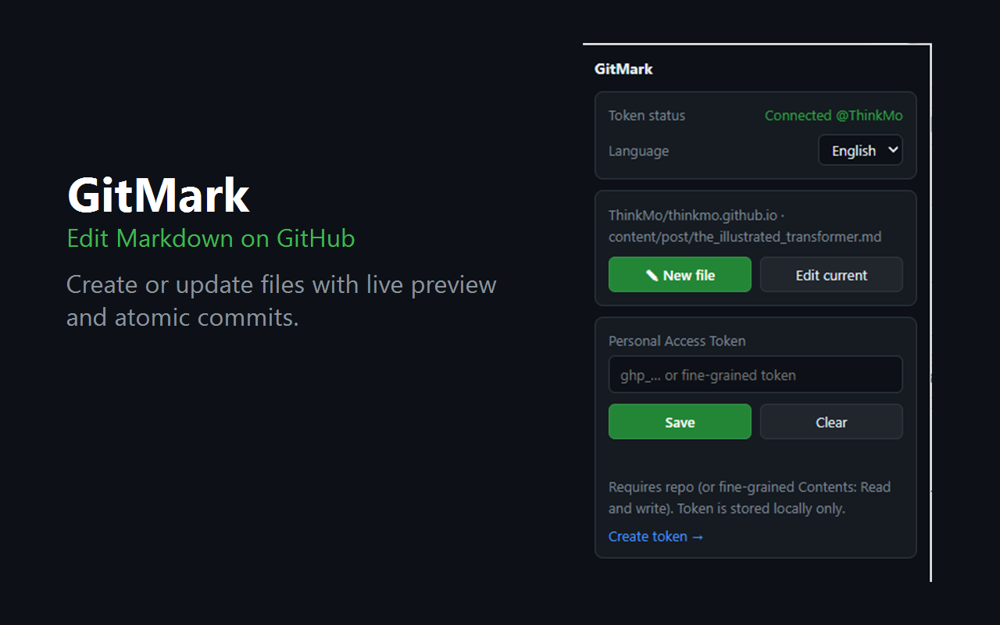

# GitMark

GitMark 是一个 Chrome 扩展（Manifest V3），用于在 GitHub 上直接新建、编辑和提交 Markdown 文件。它提供分栏实时预览、格式工具栏和图片上传，并将 Markdown 与新增图片写入同一次原子提交。

界面默认使用 English，可在扩展弹窗中切换为中文。

> 隐私：GitMark 没有自有服务器。Token 与偏好保存在浏览器本地；执行读取和提交操作时，必要数据仅通过 HTTPS 发送到 GitHub 官方 API。详见[隐私政策](PRIVACY.md)。

## 界面预览

### 扩展弹窗



### Markdown 编辑器


## 功能

- 在 GitHub Markdown 文件页注入 **✎ GitMark** 按钮，也可从扩展弹窗打开当前文件。
- 新建或更新 `.md`、`.markdown`、`.mdx` 文件。
- 左侧编辑、右侧实时预览，Markdown 渲染由本地内置的 [marked](https://github.com/markedjs/marked) 完成。
- 支持标题、粗体、斜体、删除线、列表、引用、链接、行内代码和代码块。
- 支持粘贴、拖放或选择图片，并自动插入相对路径。
- Markdown 与待上传图片通过 Git Data API 在一次原子提交中写入仓库。
- 编辑已有文件时检测远端冲突，避免覆盖加载后发生的修改。
- 支持 English / 中文及浅色 / 深色主题，偏好保存在本地。

## 快速开始

### 1. 安装扩展

当前可通过开发者模式加载：

1. 下载或克隆本仓库。
2. 在 Chrome 地址栏打开 `chrome://extensions`。
3. 打开右上角的 **开发者模式**。
4. 点击 **加载已解压的扩展程序**，选择本项目根目录。
5. 建议将 GitMark 固定到浏览器工具栏，方便打开弹窗。

### 2. 配置 GitHub Token

GitMark 使用 GitHub Personal Access Token（PAT）访问仓库：

1. 打开 [GitHub Fine-grained tokens](https://github.com/settings/tokens?type=beta) 页面创建 Token。
2. 在 **Repository access** 中选择需要编辑的仓库。
3. 在 **Repository permissions** 中将 **Contents** 设置为 **Read and write**。
4. 点击浏览器工具栏中的 GitMark 图标。
5. 将 Token 粘贴到 **Personal Access Token** 输入框并点击 **Save**。
6. 显示 `Connected @<username>` 表示验证成功。

也可以使用经典 Token，并授予 `repo` 权限。Token 保存在 `chrome.storage.local`，只作为 HTTPS 鉴权信息发送给 `api.github.com`。

### 3. 编辑已有 Markdown 文件

1. 在 GitHub 中打开一个 `.md`、`.markdown` 或 `.mdx` 文件。
2. 点击 GitHub 页面中的 **✎ GitMark**；也可以打开扩展弹窗并点击 **Edit current**。
3. 在左侧修改 Markdown，右侧会同步显示预览。
4. 根据需要使用工具栏或添加图片。
5. 点击右上角的 **Commit to GitHub**。
6. 检查提交信息和目标分支，然后点击 **Commit**。
7. 提交成功后可点击 **View commit** 查看 GitHub 提交记录。

如果文件在打开编辑器后被其他提交修改，GitMark 会取消本次提交并提示重新加载最新内容。

### 4. 新建 Markdown 文件

1. 打开 GitMark 弹窗并点击 **✎ New file**。
2. 填写 **Repo**，格式为 `owner/repo`。
3. 填写 **Branch**；留空时使用仓库默认分支。
4. 填写 **Path**，例如 `docs/getting-started.md`。
5. 输入内容并点击 **Commit to GitHub**。
6. 填写提交信息并确认提交。

如果当前标签页位于某个 GitHub 仓库，GitMark 会尽量自动填写仓库和分支。目标路径已经存在时，新建操作会被拦截，避免覆盖原文件。

### 5. 添加图片

可以通过以下方式添加图片：

- 点击工具栏中的 **🖼 Image** 选择本地图片。
- 将图片拖放到编辑区。
- 直接从剪贴板粘贴图片。

图片会暂存在编辑器中，并在提交时写入 Markdown 文件同级的 `assets/` 目录。GitMark 会自动插入相对路径，例如：

```markdown

```

新建文件时需要先填写 **Path**，GitMark 才能确定图片目录。关闭页面前未提交的图片不会上传到 GitHub。

### 6. 切换语言和主题

- 在扩展弹窗的 **Language** 下拉框中选择 **English** 或 **中文**。默认语言为 English。
- 在编辑器右上角点击 **🌙 Dark** 或 **☀️ Light** 切换主题。
- 语言和主题偏好会保存在浏览器本地。

## 常用快捷键

| 快捷键 | 操作 |
|---|---|
| `Ctrl/Cmd + B` | 加粗 |
| `Ctrl/Cmd + I` | 斜体 |
| `Ctrl/Cmd + S` | 打开提交窗口 |

## 已知限制

- 提交操作不会自动创建 Pull Request。
- Token 对目标仓库必须具有读取和写入内容的权限。
- 受 GitHub API 文件大小和请求限制约束，超大图片上传会比较慢。
- 受保护分支可能禁止直接提交，此时需要换用允许写入的分支并自行创建 Pull Request。

## 依赖与许可

- [marked](https://github.com/markedjs/marked) v12.0.2，MIT License，已内置于 `vendor/`。
- GitMark 基于 [MIT License](LICENSE) 开源。
